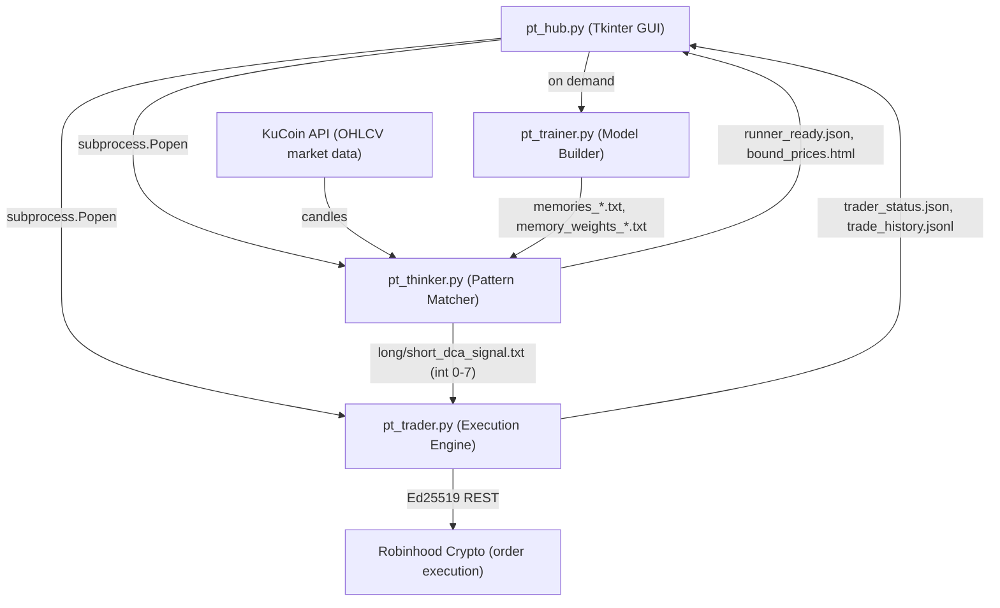
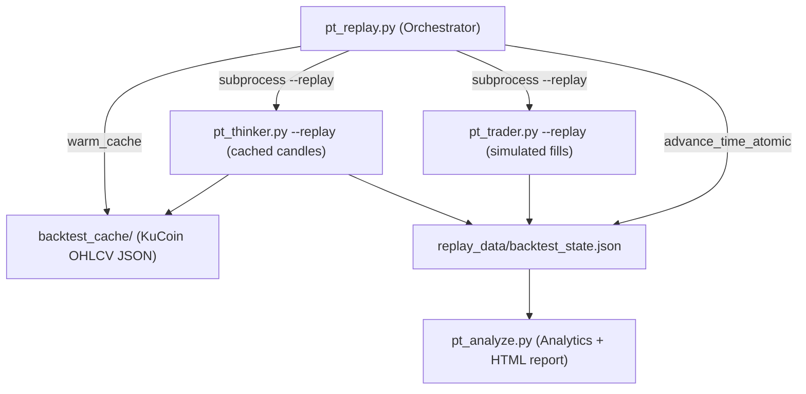

# PowerTrader AI

> **Algorithmic crypto trading with a memory-based pattern engine, multi-process architecture, and a full walk-forward backtesting suite — all in pure Python.**

[](https://www.python.org/)
[](https://www.microsoft.com/windows)
[](LICENSE)
[](https://www.kucoin.com/)
[](https://robinhood.com/crypto)

---

## Table of Contents

1. [What is PowerTrader AI?](#what-is-powertrader-ai)
2. [Architecture](#architecture)
3. [Quick Start](#quick-start)
4. [Installation](#installation)
5. [Live Trading](#live-trading)
6. [Backtesting](#backtesting)
7. [Analytics & Metrics](#analytics--metrics)
8. [Configuration](#configuration)
9. [Project Structure](#project-structure)
10. [Testing](#testing)
11. [Roadmap](#roadmap)
12. [Contributing](#contributing)
13. [License](#license)

---

## What is PowerTrader AI?

PowerTrader AI is a **local, multi-process algorithmic trading system** for cryptocurrency markets. At its core is a proprietary **Memory-based Pattern Engine** — not a traditional neural net despite the name — that:

1. Stores historical OHLCV price patterns as text files across seven timeframes (`1hour` → `1week`)
2. Continuously matches current market state against stored patterns
3. Emits **Dollar-Cost Averaging (DCA) signals** on a 0–7 intensity scale
4. Executes real orders through the **Robinhood Crypto API** (Ed25519-signed REST)

Market data comes from **KuCoin**. Everything runs locally; no cloud dependency.

### Key Features

| Feature | Detail |
|---|---|
| **Multi-process design** | Hub → Thinker, Trader, Trainer as independent subprocesses |
| **File-based IPC** | Atomic JSON/text writes; no sockets, no shared memory |
| **7 timeframes** | 1h · 2h · 4h · 8h · 12h · 1d · 1w analyzed simultaneously |
| **DCA strategy** | 0–7 signal intensity; configurable entry threshold |
| **Walk-forward backtesting** | Retrains every N days using only past data — no look-ahead bias |
| **Realistic execution sim** | Configurable slippage (volatility-adjusted), fees, partial fills |
| **Analytics suite** | Sharpe (365-day), Sortino, Calmar, true max drawdown, buy-and-hold benchmark |
| **Live GUI** | Tkinter dashboard with real-time signal tiles, equity chart, trade log |

---

## Architecture

### Live Trading



### Backtesting (Replay Mode)



### IPC File Map

| File | Writer → Reader | Content |
|---|---|---|
| `long_dca_signal.txt` / `short_dca_signal.txt` | Thinker → Trader | Integer 0–7 (DCA intensity) |
| `hub_data/trader_status.json` | Trader → Hub | Account value, positions, PnL snapshot |
| `hub_data/trade_history.jsonl` | Trader → Hub | Append-only trade log |
| `hub_data/pnl_ledger.json` | Trader → Hub | Cumulative realized PnL |
| `low/high_bound_prices.html` | Thinker → Hub | Predicted price levels |
| `hub_data/runner_ready.json` | Thinker → Hub | Startup readiness gate |
| `replay_data/backtest_state.json` | Replay → Thinker+Trader | Atomic tick (sequence + prices) |

---

## Quick Start

> **Three commands.** Warm the cache, run a backtest, open the report.

```bash
# 1. Install dependencies
pip install -r requirements.txt

# 2. Warm one month of BTC data from KuCoin (~30 seconds)
python pt_replay.py --warm-cache \
  --start-date 2024-01-01 \
  --end-date 2024-02-01 \
  --coins BTC

# 3. Run the backtest at 10× speed and open the analytics report
python pt_replay.py --backtest \
  --start-date 2024-01-01 \
  --end-date 2024-02-01 \
  --coins BTC \
  --speed 10.0

# (after backtest completes, a timestamped directory is printed — use it below)
python pt_analyze.py backtest_results/backtest_2024-01-01_HHMMSS --show-regime
```

The final command writes `analytics_report.html` — open it in any browser.

<!-- 📹 SETUP GIF: Replace this comment with a 2-minute screen-recording GIF showing
     the three commands above running in a terminal, ending with the HTML report opening.
     Recommended tools: peek (Linux), LICEcap (Windows), Kap (Mac).
     Target: ~2 min, 800×500px, < 8MB.
     Example embed:  -->

---

## Installation

### Prerequisites

- **Python 3.8+** (Windows; see [CLAUDE.md](CLAUDE.md) for platform notes)
- `pip` package manager
- Internet access (KuCoin API for data; Robinhood API for live trading)

### Install

```bash
git clone https://github.com/JackSmack1971/power-trader-ai.git
cd power-trader-ai
pip install -r requirements.txt
```

### API Credentials (live trading only)

Live trading requires Robinhood Crypto API credentials stored as plain-text files in the project root:

| File | Content |
|---|---|
| `r_key.txt` | Your Robinhood API key string |
| `r_secret.txt` | Base64-encoded Ed25519 private key |

**Never commit these files.** They are listed in `.gitignore`.

Generate them via the Hub: **Settings → Robinhood API → Setup Wizard**.

> **Note:** `pt_trader.py` exits immediately at import time if either file is missing. This also affects any test that imports the trader — keep credentials out of CI.

---

## Live Trading

### Start the System

```bash
python pt_hub.py
```

The Hub GUI opens and gives you full control:

- **Start All** — launches Thinker and Trader as subprocesses
- **Train** — runs the model trainer for a selected coin
- **Settings** — configure coins, neural directory, Robinhood credentials

<!-- 📸 SCREENSHOT: Replace with a screenshot of the Hub GUI showing the signal tiles
     and equity chart. Recommended: 1280×800px PNG.
     Example embed:  -->

### How Signals Work

The Thinker polls KuCoin every candle close, runs the pattern-matching algorithm across all seven timeframes, and writes an integer 0–7 to each signal file:

```
long_dca_signal.txt   →  5   (strong buy signal)
short_dca_signal.txt  →  0   (no sell signal)
```

The Trader reads these files on each loop. When `long_dca_signal ≥ 3` (configurable), it places a DCA buy order at the Robinhood ask price. Sells are triggered by a trailing profit margin that activates after the position reaches a configurable PnL threshold.

### Training the Model

The pattern engine needs trained memory files before it can produce signals. Train per-coin:

```bash
python pt_trainer.py BTC     # builds memories_*.txt and memory_weights_*.txt
python pt_trainer.py ETH
python pt_trainer.py DOGE
```

The Hub displays a warning if model files are older than **14 days** and blocks Thinker startup until retraining completes.

---

## Backtesting

### How It Works

The backtesting system replays cached historical data through the **same** `pt_thinker.py` and `pt_trader.py` code used for live trading — just with `--replay` flags. This means every backtest result is a faithful simulation of live system behavior.

**Walk-forward validation** is on by default: the model retrains every 7 days using only data available up to that point, preventing look-ahead bias.

### Step 1 — Warm the Cache

```bash
# Single coin, one month
python pt_replay.py --warm-cache \
  --start-date 2024-01-01 \
  --end-date 2024-02-01 \
  --coins BTC

# Multiple coins, six months (all seven timeframes)
python pt_replay.py --warm-cache \
  --start-date 2024-01-01 \
  --end-date 2024-06-30 \
  --coins BTC,ETH,DOGE

# Cache specific timeframes only
python pt_replay.py --warm-cache \
  --start-date 2024-01-01 \
  --end-date 2024-03-01 \
  --coins BTC \
  --timeframes 1hour,4hour,1day
```

Cache files land in `backtest_cache/` and are reused on subsequent runs — the API is never called twice for the same range.

### Step 2 — Run the Backtest

```bash
# Standard run (walk-forward enabled, 10× speed)
python pt_replay.py --backtest \
  --start-date 2024-01-01 \
  --end-date 2024-06-30 \
  --coins BTC,ETH \
  --speed 10.0

# Skip walk-forward retraining (faster, uses whatever model is on disk)
python pt_replay.py --backtest \
  --start-date 2024-01-01 \
  --end-date 2024-04-01 \
  --coins BTC \
  --speed 50.0 \
  --no-walk-forward

# Custom output directory and retrain interval
python pt_replay.py --backtest \
  --start-date 2024-01-01 \
  --end-date 2024-07-01 \
  --coins BTC \
  --output-dir my_results/q1_q2_2024 \
  --retrain-interval 14
```

**Speed guide:**

| `--speed` | Use case |
|---|---|
| `1.0` | Real-time pacing (debugging sync) |
| `10.0` | Recommended — balances fidelity and throughput |
| `50.0`+ | Maximum speed; may stress-test subprocess sync |

A 6-month single-coin backtest at `--speed 10.0` completes in **< 10 minutes**.

### Step 3 — Generate the Analytics Report

```bash
python pt_analyze.py backtest_results/backtest_2024-01-01_120000

# With market regime breakdown
python pt_analyze.py backtest_results/backtest_2024-01-01_120000 --show-regime

# Custom output path
python pt_analyze.py backtest_results/backtest_2024-01-01_120000 \
  --output reports/q1_analysis.html
```

<!-- 📸 SCREENSHOT: Replace with a screenshot of the analytics_report.html open in a
     browser, showing the executive summary table and equity curve chart.
     Example embed:  -->

---

## Analytics & Metrics

The analytics engine (`pt_analyze.py`) computes the following from the backtest equity curve and trade log:

### Risk-Adjusted Return Metrics

| Metric | Formula | Notes |
|---|---|---|
| **Sharpe Ratio** | `(mean_return − RFR) / std_dev × √365` | 365-day annualization (crypto trades 24/7, not 252 trading days) |
| **Sortino Ratio** | `(mean_return − RFR) / downside_std × √365` | Penalizes only downside volatility |
| **Calmar Ratio** | `annualized_return / max_drawdown` | Return per unit of maximum drawdown |
| **Max Drawdown** | Peak-to-trough on total equity | Includes **unrealized** losses — traditional methods miss this |

### Example Report Output

```
══════════════════════════════════════════════════════
 POWERTRADER AI — BACKTEST ANALYTICS
 Period : 2024-01-01 → 2024-06-30  (181 days)
 Coins  : BTC, ETH
══════════════════════════════════════════════════════

 EXECUTIVE SUMMARY
 ─────────────────────────────────────────────────────
 Total Return         +18.4 %
 Annualized Return    +37.2 %
 Sharpe Ratio          1.82
 Max Drawdown         -9.3 %   (peak 2024-03-14, trough 2024-03-20)
 Drawdown Duration     6 days

 RISK METRICS
 ─────────────────────────────────────────────────────
 Sortino Ratio         2.41
 Calmar Ratio          4.00
 Volatility (ann.)    20.4 %

 TRADE STATISTICS
 ─────────────────────────────────────────────────────
 Total Trades           47
 Win Rate              63.8 %
 Avg Win              +2.1 %
 Avg Loss             -0.9 %
 Profit Factor          3.7

 BENCHMARK
 ─────────────────────────────────────────────────────
 Buy-and-Hold Return  +12.1 %
 Strategy Alpha        +6.3 %

══════════════════════════════════════════════════════
```

> *Values above are illustrative. Your results will vary based on market conditions, trained model quality, and configuration.*

### Market Regime Analysis (`--show-regime`)

When enabled, the report breaks performance down by detected market regime:

| Regime | Win Rate | Avg Return |
|---|---|---|
| Bull, low volatility | 71 % | +2.4 % |
| Bull, high volatility | 58 % | +1.1 % |
| Bear, low volatility | 55 % | +0.3 % |
| Bear, high volatility | 42 % | −0.8 % |
| Sideways | 61 % | +0.9 % |

Regime detection uses a 50/200 SMA crossover (trend) combined with rolling volatility quantiles.

---

## Configuration

### Execution Model (`backtest_config.json`)

Place this file in the backtest output directory to override defaults:

```json
{
  "execution_model": {
    "slippage_bps": 5,
    "fee_bps": 20,
    "max_volume_pct": 1.0,
    "latency_ms": [50, 500],
    "partial_fill_threshold": 0.01
  }
}
```

| Parameter | Default | Description |
|---|---|---|
| `slippage_bps` | `5` | Base slippage in basis points (0.05%); multiplied up to 2.5× on high volatility |
| `fee_bps` | `20` | Round-trip transaction fee (0.20% — Robinhood Crypto standard) |
| `max_volume_pct` | `1.0` | Max order size as % of candle volume; triggers partial fills |
| `latency_ms` | `[50, 500]` | Simulated network latency range; adds 0–2 bps extra slippage |
| `partial_fill_threshold` | `0.01` | Volume fraction below which partial fill logic activates |

### GUI Settings (`gui_settings.json`)

Auto-generated on first Hub launch. Key fields:

```json
{
  "main_neural_dir": "C:\\PowerTrader_AI",
  "coins": ["BTC", "ETH", "XRP", "BNB", "DOGE"],
  "ui_refresh_seconds": 1.0,
  "chart_refresh_seconds": 10.0
}
```

> **Windows note:** `main_neural_dir` defaults to `C:\PowerTrader_AI`. Change this in Hub → Settings on first run if your project lives elsewhere.

Both `pt_thinker.py` and `pt_trader.py` hot-reload this file on every loop iteration (mtime-cached), so coin list changes take effect without restarting the subprocesses.

---

## Project Structure

```
power-trader-ai/
│
│  ── Core system ──────────────────────────────────────────
├── pt_hub.py                 # Tkinter GUI; subprocess lifecycle; settings wizard
├── pt_thinker.py             # Pattern matcher; KuCoin polling; DCA signal writer
├── pt_trader.py              # Robinhood executor; DCA + trailing profit margin logic
├── pt_trainer.py             # Builds memory/weight files from historical candles
│
│  ── Backtesting ───────────────────────────────────────────
├── pt_replay.py              # Orchestrator; cache warming; RealisticExecutionEngine
├── pt_analyze.py             # Equity curve; Sharpe/Sortino/Calmar; HTML reports
├── pt_incremental_trainer.py # Walk-forward trainer (--train-until timestamp)
│
│  ── Tests ─────────────────────────────────────────────────
├── tests/
│   ├── test_backtest_integration.py  # IPC sync, slippage, equity curve correctness
│   ├── test_e2e_smoke.py             # Full workflow smoke test (KuCoin mocked)
│   ├── test_performance.py           # 6-month benchmark (< 10 min target)
│   └── test_walk_forward.py          # No look-ahead bias verification
│
│  ── Documentation ─────────────────────────────────────────
├── docs/
│   ├── BACKTESTING_GUIDE.md          # Detailed CLI + config reference
│   ├── BACKTESTING_BLUEPRINT.md      # 6-phase implementation plan
│   ├── PHASE4_WALK_FORWARD_IMPLEMENTATION.md
│   ├── FINAL_INTEGRATION_TEST_CHECKLIST.md
│   └── proposals/backtesting-feature.md
│
│  ── Config & secrets (gitignored) ──────────────────────────
├── r_key.txt                 # Robinhood API key — DO NOT COMMIT
├── r_secret.txt              # Base64 Ed25519 private key — DO NOT COMMIT
├── gui_settings.json         # Runtime settings — auto-generated
│
│  ── Runtime directories (gitignored) ───────────────────────
├── backtest_cache/           # KuCoin OHLCV cache
├── backtest_results/         # Backtest output + HTML reports
└── hub_data/                 # Live IPC state files
```

---

## Testing

```bash
# Run all tests
python -m unittest discover -s tests

# Individual suites
python -m unittest tests.test_backtest_integration  # IPC + slippage + equity
python -m unittest tests.test_e2e_smoke             # Full workflow (offline, KuCoin mocked)
python -m unittest tests.test_walk_forward          # No look-ahead bias
python -m unittest tests.test_performance           # 6-month benchmark — slow, ~10 min
```

All tests in `test_e2e_smoke.py` run **fully offline** — KuCoin API calls are patched with synthetic candle data via `unittest.mock`.

> **CI note:** Tests that import `pt_trader.py` require `r_key.txt` and `r_secret.txt` to exist, because the module reads them at import time. Create stub files or set `POWERTRADER_GUI_SETTINGS` to a test path in your CI environment.

---

## Roadmap

| Status | Feature |
|---|---|
| ✅ Done | Multi-process live trading (Hub + Thinker + Trader + Trainer) |
| ✅ Done | 7-timeframe memory-based pattern engine |
| ✅ Done | Walk-forward backtesting with realistic execution simulation |
| ✅ Done | Analytics suite (Sharpe, Sortino, Calmar, max drawdown, regime) |
| ✅ Done | Paper trading mode (`--paper` flag, live KuCoin prices) |
| ✅ Done | Strategy parameter optimization (grid/random/diffevo/Bayesian) |
| ✅ Done | Monte Carlo simulation in analytics reports |
| ✅ Done | CCXT multi-exchange data adapter (Binance, Bybit, OKX…) |
| ✅ Done | Telegram & Discord trade/signal alerts |
| ✅ Done | Streamlit web dashboard with control panel (start/stop) |
| ✅ Done | Docker one-command stack with Redis IPC |
| 🔲 Planned | Linux / Mac path polish |
| 🔲 Planned | Correlation-aware portfolio limits |
| 🔲 Planned | Binance/Bybit order execution (CCXT exec adapter) |

---

## Migration Guide (v1.1 → v1.2)

### New optional dependencies

```bash
pip install ccxt plotly scikit-learn
# or use the full requirements.txt
pip install -r requirements.txt
```

### Telegram / Discord alerts

Set environment variables — no code changes required:

```bash
# .env (or export in shell)
TELEGRAM_TOKEN=<your-bot-token>
TELEGRAM_CHAT_ID=<your-chat-id>
DISCORD_WEBHOOK_URL=https://discord.com/api/webhooks/...
```

Test delivery:

```bash
python pt_alerts.py
```

### CCXT multi-exchange data

Set `CCXT_EXCHANGE` to switch from KuCoin to another exchange for market data:

```bash
CCXT_EXCHANGE=binance python pt_trader.py --paper
```

Per-coin override via `ccxt_config.json` (see `ccxt_config.json.example`).  
KuCoin remains the default — no change needed if you don't set these.

### Dashboard control panel

The Streamlit dashboard now includes a **Control Panel** tab for starting/stopping subprocesses and editing coin settings without restarting the hub. Access it at `http://localhost:8501` after `streamlit run pt_dashboard.py`.

### Optimizer v2 (Bayesian search)

```bash
python pt_optimizer.py \
    --start-date 2024-01-01 --end-date 2024-06-01 \
    --coins BTC --trials 30 --method bayesian --metric sharpe
# → optimizer_results/<run>/optimizer_report.html  (visualization)
# → optimizer_results/<run>/best_config.json       (apply to live trading)
```

### Monte Carlo in analytics reports

Monte Carlo (500 bootstrap paths) is now included automatically in every analytics HTML report.  No configuration needed — it runs as part of `python pt_analyze.py <backtest_dir>`.

---

## Contributing

1. Fork the repo and create a feature branch off `main`
2. Follow the coding conventions in [CLAUDE.md](CLAUDE.md) — especially the **atomic write mandate** and the **tab vs. space indentation split**
3. Add or update tests for any changed behavior
4. Open a pull request with a clear description of what changed and why

### Key conventions to know before editing

- **Tabs** in `pt_thinker.py`, `pt_trader.py`, `pt_trainer.py`; **4 spaces** everywhere else. Python 3 will raise `TabError` if you mix them in a single file.
- All JSON and plain-text state files must be written via `_atomic_write_json()` / `_atomic_write_text()` (write to `.tmp`, then `os.replace()`).
- `pt_thinker.py` calls `os.chdir()` into each coin folder. Never add threading to that module without removing that pattern first.

---

## License

MIT © 2025 [JackSmack1971](https://github.com/JackSmack1971)

See [LICENSE](LICENSE) for the full text.

---

<p align="center">
  Built with Python · Data by KuCoin · Execution via Robinhood Crypto
</p>
